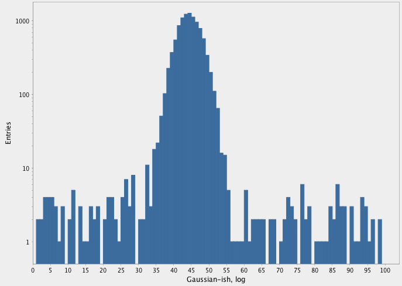

# logplots

I wanted to make histograms, log scale preferred[1].

Why was it so hard?

C.f. http://johnj.com/nucleotide-repetition-lengths.html

This repo provides a more up-to-date version of that.  I'll probably
add other graphing / plotting / histogramming things here as needed.

[1] Logarithmic-scale histograms are extremely common in particle
physics, which is where I cut my teeth. I still use them for all sorts
of things, and it amazes me that they're not more commonly used.

## Coordinates

    [eigenhombre/logplots "0.0.1"]

## Example

    (require '[logplots.histo :as h])
    (->> #(apply + (repeatedly 100 rand))
         (repeatedly 10000)
         (concat (repeatedly 1000 #(rand-int 400)))
         (h/make-hist 10 100 100)
         (h/draw-hist "Gaussian-ish, log" true))

## License

Copyright © 2019 John Jacobsen

This program is free software. It comes without any warranty, to
the extent permitted by applicable law. You can redistribute it
and/or modify it under the terms of the Do What The F~~~ You Want
To Public License, Version 2, as published by Sam Hocevar. See
yhttp://www.wtfpl.net/ for more details.
